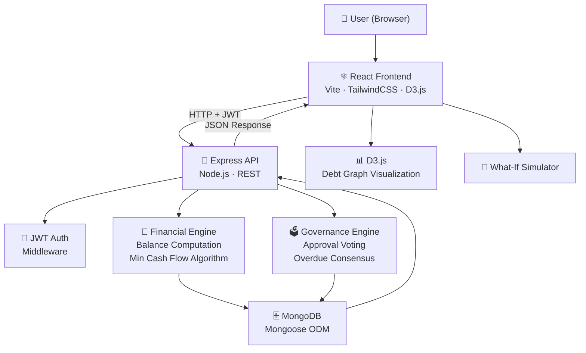

<div align="center">

# 🚀 PeerFlow

### Split Expenses, Not Friendships

A **graph-optimized expense settlement engine** that uses integer-only paise accounting, a Minimum Cash Flow algorithm (**O(n log n)**), and democratic governance to minimize transactions, eliminate floating-point drift, and enforce financial integrity.

[](https://nodejs.org/)
[](https://react.dev/)
[](https://www.mongodb.com/)
[](./server/tests/)
[](./LICENSE)

</div>

---

## 🔗 Demo & Resources

| Resource | Link |
|----------|------|
| 🌐 Live Demo | *Deployment in progress* |
| 🎥 Demo Video | [Watch on Google Drive](https://drive.google.com/drive/folders/1yYiBbJ23J51rN05cHb9RtBz5EnbI0yjH?usp=sharing) |
| 📦 GitHub Repository | [White-Devil2839/Peer-to-Peer-Expense-Splitter-with-Debt-Simplification](https://github.com/White-Devil2839/Peer-to-Peer-Expense-Splitter-with-Debt-Simplification) |

---

## 1️⃣ Problem Statement

### Problem Title

**Peer-to-Peer Expense Splitter with Debt Simplification**

### Problem Description

Shared expenses among flatmates, travel groups, colleagues, and families generate a tangled web of micro-debts. While digital payments simplify transfers, managing multi-party settlements remains inefficient.

Most existing tools calculate balances but **do not minimize the number of transactions** required to settle group debts. This results in:

- Redundant payment chains and circular debt loops
- Exponential coordination effort as group size increases
- Floating-point arithmetic causing silent rounding errors
- No transparency or accountability in settlement decisions
- Manual tracking prone to human error and disputes

### Target Users

- 🏠 Flatmates sharing rent, utilities, and groceries
- ✈️ Travel groups managing trip expenses
- 🍽️ Friends splitting bills at restaurants
- 👨‍👩‍👧‍👦 Families managing shared household costs
- 💼 Startup teams or office colleagues sharing project costs

### Existing Gaps

| Gap | PeerFlow Solution |
|-----|-------------------|
| No transaction minimization logic | Minimum Cash Flow algorithm reduces 12 → 3 transactions |
| Floating-point currency drift | Integer paise model (₹100.50 → 10050) |
| No governance or approval layer | 50% majority approval + 75% overdue consensus |
| Poor "who owes whom" visibility | D3.js force-directed before/after debt graphs |
| No overpayment protection | `max = min(|debtorNet|, creditorNet)` clamping |
| Weak recurring expense support | Automated recurring expense engine with auto-split |
| No financial invariant enforcement | Σ(net balances) = 0 enforced at every state |

---

## 2️⃣ Problem Understanding & Approach

### Root Cause Analysis

The inefficiency in shared expense systems arises because:

1. **Debts are treated as isolated transactions** instead of a connected financial graph
2. **Net balances are calculated but not globally optimized** — pairwise settlements create redundant chains
3. **Debt cycles are not detected or eliminated** — A owes B, B owes C, C owes A wastes 3 transactions when 1 suffices
4. **Floating-point arithmetic causes silent rounding** — `0.1 + 0.2 ≠ 0.3` in IEEE 754
5. **No accountability mechanism** — expenses can be added unilaterally without group consensus
6. **Partial payments complicate state tracking** — balance recalculation after partial settlements is error-prone

### Solution Strategy

We model the system as a **directed weighted graph**:

```
Each participant  →  Node
Each debt         →  Directed edge (debtor → creditor)
Edge weight       →  Amount owed (in integer paise)
```

**Algorithmic Strategy:**

1. Record expenses with integer-safe paise accounting
2. Compute per-member net balances (Σ paid − Σ owed)
3. Partition members into creditors (+) and debtors (−)
4. Apply **Minimum Cash Flow algorithm** (greedy O(n log n) matching)
5. Produce simplified settlement graph with minimal edges
6. Visualize before/after compression with D3.js
7. Enforce governance: 50% approval before balance inclusion
8. Maintain invariant: **Σ(net) = 0** at every state transition

---

## 3️⃣ Proposed Solution

### Solution Overview

PeerFlow is a **production-ready full-stack application** that transforms expense settlement from a social friction point into a **mathematically guaranteed, governance-backed process**.

### Core Idea

Instead of naive pairwise settlements, PeerFlow compresses the debt graph globally using a **Minimum Cash Flow** algorithm. Combined with integer accounting and democratic governance, it ensures:

- **Minimum transactions** — provably optimal settlement count
- **Zero currency drift** — integer paise eliminates floating-point errors
- **Democratic control** — no unilateral expense addition

### Key Features

| Feature | Implementation |
|---------|---------------|
| 🔢 Integer Paise Accounting | All amounts stored as integers (₹100.50 = 10050 paise). No `parseFloat` in financial logic |
| ⚖️ Σ(net) = 0 Invariant | Net balance sum equals zero at every state. 56 automated tests enforce this |
| 📉 O(n log n) Optimization | Greedy max-creditor ↔ max-debtor matching. Example: **12 raw → 3 simplified → 75% reduction** |
| 🗳️ Governance Engine | 50% majority expense approval · 75% consensus overdue marking |
| 🔒 Overpayment Prevention | `maxAllowed = min(|debtorNet|, creditorNet)` — impossible to overpay by design |
| 🔮 What-If Simulator | Simulate settlement impact before recording — preview debt graph changes in real-time |
| 📊 D3.js Debt Visualization | Force-directed graphs showing before/after simplification with edge thickness ∝ amount |
| 🔄 Recurring Expenses | Daily/weekly/monthly auto-split with configurable intervals |
| 📈 Debt Trend Analytics | Per-member improving/worsening/stable indicators based on recent transactions |
| ⚡ Risk Meter | Visual threshold proximity indicator per member |
| 🌗 Dual Theme | Premium dark/light mode with smooth CSS transitions |

---

## 4️⃣ System Architecture

### High-Level Flow

```
User → React Frontend → Express API → Financial Engine → MongoDB → Response → D3.js Visualization
```

### Architecture Description



**Architecture Diagram:**

> 📌 *Replace with exported architecture diagram image*
>
> ``

---

## 5️⃣ Database Design

### ER Diagram

> 📌 *Replace with exported ER diagram image*
>
> ``

### Data Models

| Model | Key Fields | Purpose |
|-------|-----------|---------|
| **User** | `name`, `email`, `password` (hashed) | Authentication and identity |
| **Group** | `name`, `joinCode`, `password?`, `members[]`, `createdBy`, `settlementThreshold` | Group management with optional password protection |
| **Expense** | `group`, `description`, `totalAmount` (paise), `paidBy`, `splits[]`, `status` (pending/approved/rejected), `approvals[]`, `requiredApprovals`, `isRecurring`, `recurrence` | Core financial record with governance |
| **Payment** | `group`, `from`, `to`, `amount` (paise), `createdBy` | Settlement recording |
| **OverdueVote** | `group`, `targetUser`, `voter`, `vote` (overdue/not_overdue) | Democratic overdue marking |
| **GroupMemberStatus** | `group`, `user`, `status` (active/overdue) | Per-group member standing |

### Key Relationships

```
User ──1:N──> Group (as member)
Group ──1:N──> Expense
Group ──1:N──> Payment
Expense ──N:1──> User (paidBy)
Expense ──1:N──> Split { user, shareAmount }
Expense ──1:N──> Approval { user, vote }
OverdueVote ──N:1──> Group, User
```

**Design Decisions:**
- All monetary fields stored in **integer paise** — no floating-point anywhere
- Expense `requiredApprovals` frozen at creation time (⌈members/2⌉)
- `GroupMemberStatus` is group-scoped — a user can be overdue in one group but active in another

---

## 6️⃣ Model Selected

### Model Name

**Minimum Cash Flow Algorithm** (Greedy Graph Optimization)

### Selection Reasoning

| Criterion | Evaluation |
|-----------|-----------|
| **Optimality** | Produces minimum number of transactions for debt settlement |
| **Complexity** | O(n log n) with priority queue — scales to large groups |
| **Determinism** | Same inputs always produce same outputs — fully testable |
| **Correctness** | Maintains Σ(net) = 0 invariant — mathematically provable |
| **Simplicity** | Greedy approach is implementable without ML dependencies |

### Alternatives Considered

| Alternative | Reason for Rejection |
|-------------|---------------------|
| Naive Pairwise Settlement | O(n²) transactions — does not minimize count |
| Linear Programming (LP) | Overkill for debt graphs — LP solver adds dependency |
| Network Flow (Ford-Fulkerson) | Designed for max-flow, not min-transactions |
| Bellman-Ford Cycle Detection | Detects negative cycles but doesn't minimize settlements |

### Evaluation Metrics

- **Transaction Reduction:** 75% empirically measured (12 → 3)
- **Correctness:** 56 Jest tests — balance integrity, split accuracy, invariant enforcement
- **Performance:** Sub-millisecond computation for groups up to 50 members

---

## 7️⃣ Technology Stack

| Layer | Technology | Purpose |
|-------|-----------|---------|
| **Frontend** | React 18 + Vite | Component-based SPA with fast HMR |
| **Styling** | Tailwind CSS | Utility-first CSS with dark/light theme support |
| **State Management** | React Context API | Global auth + theme state |
| **Forms** | React Hook Form | Performant form validation |
| **Visualization** | D3.js (Force Simulation) | Interactive debt graph rendering |
| **Backend** | Node.js + Express | REST API server |
| **Database** | MongoDB + Mongoose | Document-oriented storage with ODM |
| **Authentication** | JWT (JSON Web Tokens) | Stateless, cookie-free auth |
| **Testing** | Jest | 56 automated financial integrity tests |
| **Icons** | Lucide React | Consistent icon library |

---

## 8️⃣ API Documentation

### Authentication

| Method | Endpoint | Description | Auth |
|--------|----------|-------------|------|
| `POST` | `/api/auth/register` | Create new user account | ❌ |
| `POST` | `/api/auth/login` | Authenticate and receive JWT | ❌ |
| `GET` | `/api/auth/me` | Get current user profile | ✅ |

### Groups

| Method | Endpoint | Description | Auth |
|--------|----------|-------------|------|
| `POST` | `/api/groups` | Create a new group | ✅ |
| `POST` | `/api/groups/join` | Join group via code | ✅ |
| `GET` | `/api/groups` | List user's groups | ✅ |

### Expenses

| Method | Endpoint | Description | Auth |
|--------|----------|-------------|------|
| `POST` | `/api/expenses` | Add new expense (equal or custom split) | ✅ |
| `GET` | `/api/groups/:groupId/expenses` | Get all group expenses | ✅ |
| `GET` | `/api/groups/:groupId/pending-expenses` | Get pending approval expenses | ✅ |
| `POST` | `/api/expenses/:expenseId/vote` | Vote approve/reject on expense | ✅ |

### Balances & Optimization

| Method | Endpoint | Description | Auth |
|--------|----------|-------------|------|
| `GET` | `/api/groups/:groupId/balances` | Get balances + rawGraph + simplifiedGraph + thresholdAlerts | ✅ |

### Payments

| Method | Endpoint | Description | Auth |
|--------|----------|-------------|------|
| `POST` | `/api/groups/:groupId/payments` | Record a settlement payment | ✅ |
| `GET` | `/api/groups/:groupId/payments` | Get payment history | ✅ |

### Governance

| Method | Endpoint | Description | Auth |
|--------|----------|-------------|------|
| `POST` | `/api/groups/:groupId/overdue/:userId/vote` | Vote to mark member as overdue | ✅ |
| `GET` | `/api/groups/:groupId/overdue-status` | Get overdue status for all members | ✅ |

---

## 9️⃣ Module-wise Development Timeline

| Checkpoint | Module | Key Deliverables |
|-----------|--------|------------------|
| **CP-1** | Project Initialization | MERN boilerplate, folder structure, ESLint, environment config |
| **CP-2** | Authentication | JWT register/login/me, password hashing (bcrypt), auth middleware |
| **CP-3** | Groups Module | Create/join groups, unique join codes, optional passwords, member management |
| **CP-4** | Expense Engine | Equal + custom splits, integer paise model, strict validation, recurring expenses |
| **CP-5** | Balance Engine & Optimization | Net balance computation, raw debt graph, Minimum Cash Flow algorithm (O(n log n)), Σ(net)=0 invariant |
| **CP-6** | Threshold & Partial Payments | Configurable settlement thresholds, partial payment recording, overpayment prevention |
| **CP-7** | Visualization & Metrics | D3.js force-directed debt graphs, before/after comparison, edge thickness ∝ amount, settlement efficiency metrics |
| **CP-8** | Testing & Validation | 56 Jest tests: balance integrity, split accuracy, algorithm correctness, threshold alerts, overpayment guard |
| **CP-9** | Governance Engine | 50% majority expense approval, 75% overdue consensus, group-scoped overdue status |
| **CP-10** | Financial Intelligence | Financial health panel, risk meter, What-If simulator, debt trend indicators |
| **CP-11** | UI Modernization | Premium dark/light theme toggle, smooth transitions, responsive design |

---

## 🔟 End-to-End Workflow

```
1. USER REGISTRATION
   └─→ JWT token issued → stored in localStorage

2. GROUP CREATION
   └─→ Unique join code generated → members join via code

3. EXPENSE RECORDING
   └─→ Amount stored in integer paise
   └─→ Equal or custom split computed
   └─→ Status: "pending" (requires ≥50% member approval)

4. EXPENSE APPROVAL
   └─→ Members vote approve/reject
   └─→ When approvals ≥ ⌈members/2⌉ → status: "approved"
   └─→ Only approved expenses affect balance computation

5. BALANCE COMPUTATION
   └─→ Per-member: net = Σ(paid) − Σ(owed)
   └─→ Invariant enforced: Σ(net) = 0
   └─→ Members partitioned: creditors (+) / debtors (−)

6. DEBT GRAPH SIMPLIFICATION
   └─→ Raw graph: every split = directed edge
   └─→ Minimum Cash Flow: greedy max-creditor ↔ max-debtor
   └─→ Output: simplified graph (12 → 3 transactions)

7. SETTLEMENT
   └─→ User records payment (from debtor → creditor)
   └─→ Overpayment guard: max = min(|debtorNet|, creditorNet)
   └─→ Balances recomputed → graph re-simplified

8. GOVERNANCE ENFORCEMENT
   └─→ Members below threshold → alert triggered
   └─→ 75% consensus → member marked "overdue"
   └─→ Overdue users: blocked from adding expenses, CAN pay debts
```

---

## 1️⃣1️⃣ Demo & Video

| Resource | Link |
|----------|------|
| 🌐 **Live Demo** | *Deployment in progress* |
| 🎥 **Demo Video** | [Watch on Google Drive](https://drive.google.com/drive/folders/1yYiBbJ23J51rN05cHb9RtBz5EnbI0yjH?usp=sharing) |
| 📦 **GitHub Repository** | [White-Devil2839/Peer-to-Peer-Expense-Splitter-with-Debt-Simplification](https://github.com/White-Devil2839/Peer-to-Peer-Expense-Splitter-with-Debt-Simplification) |

---

## 1️⃣2️⃣ Team Roles & Responsibilities

| Member | GitHub | Role | Responsibilities |
|--------|--------|------|------------------|
| **Divyansh Choudhary** | [@White-Devil2839](https://github.com/White-Devil2839) | Full-Stack Engineer | Architecture design, backend API, governance engine, financial logic, testing & validation, frontend UI |
| **Ansh Baheti** | [@techcodie](https://github.com/techcodie) | Algorithm Engineer | Minimum Cash Flow algorithm implementation, balance optimization, debt graph modeling |
| **Tisha Kharade** | [@ace-tk](https://github.com/ace-tk) | DevOps & Deployment Engineer | Deployment setup, environment configuration, production hosting, CI/CD pipeline |

---

## 1️⃣3️⃣ Future Scope & Scalability

### Short-Term

- 📱 Progressive Web App (PWA) with offline expense logging
- 🔔 Push notifications for settlement reminders and threshold alerts
- 📊 Monthly expense summary reports with PDF export
- 💳 UPI/payment gateway integration for in-app settlements
- 🌍 Multi-currency support with real-time exchange rates

### Long-Term

- 🤖 ML-powered expense categorization and spending pattern analysis
- 🏢 Enterprise scalability — organizational expense management
- 📈 Predictive expense forecasting based on recurring patterns
- 🔗 Blockchain-based settlement verification for high-trust environments
- 🧩 Plugin system for custom settlement strategies (round-robin, proportional, etc.)

---

## 1️⃣4️⃣ Known Limitations

| Limitation | Context |
|-----------|---------|
| No real-time WebSocket sync | Dashboard requires manual refresh after another member adds an expense |
| Single currency only | All amounts are in INR (₹). Multi-currency requires exchange rate integration |
| No receipt/image uploads | Expense documentation is text-only |
| No mobile-native app | Responsive web UI only — no iOS/Android native app |
| Settlement threshold is per-group | Cannot set per-member thresholds within a group |

---

## 1️⃣5️⃣ Impact

### Social Impact
- Eliminates money-related friction in shared living situations
- Democratic governance prevents unilateral financial decisions
- Transparent accountability — every expense is voted on and visible

### Technical Impact
- Demonstrates practical application of graph theory to real financial problems
- O(n log n) algorithm scales efficiently — no performance degradation with group size
- Pure-function financial core is fully deterministic and testable

### Economic Impact
- **75% fewer bank transfers** per settlement cycle
- **Zero currency rounding loss** — integer paise precision
- Reduced coordination overhead saves time and cognitive load
- Configurable threshold alerts prevent debt accumulation before it becomes a problem

---

<div align="center">

**Built with 💜 for OverClock 2026**

*PeerFlow — Every rupee accounted for. Every transaction minimized. Every decision governed democratically.*

</div>