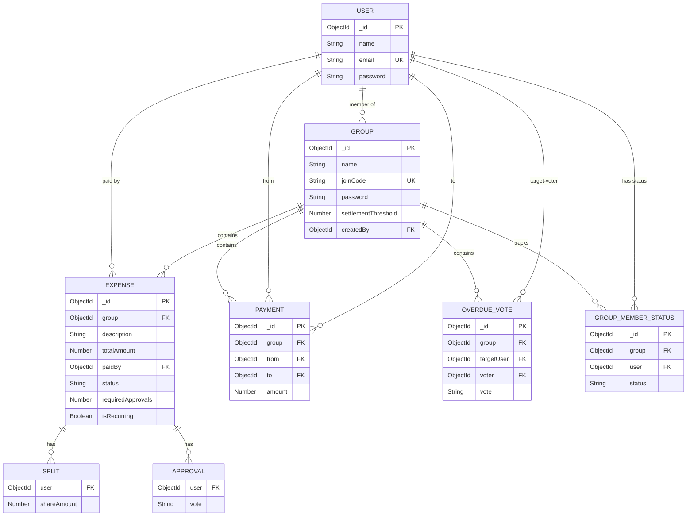

# 🚀 PeerFlow  
### Split Expenses. Not Friendships.

A graph-optimized peer-to-peer expense settlement engine that uses integer-only paise accounting, a Minimum Cash Flow algorithm (O(n log n)), and democratic governance to minimize transactions and enforce strict financial integrity.

---

## 🔗 Demo & Resources

| Resource | Link |
|----------|------|
| 🌐 Live Demo | https://peer-to-peer-expense-splitter-with-chi.vercel.app/ |
| 🎥 Demo Video | https://drive.google.com/drive/folders/1yYiBbJ23J51rN05cHb9RtBz5EnbI0yjH?usp=sharing |
| 📦 GitHub Repository | https://github.com/White-Devil2839/Peer-to-Peer-Expense-Splitter-with-Debt-Simplification |

---

# 1️⃣ Problem Statement

Managing shared expenses creates complex debt chains between members.  
Most existing tools calculate balances but **do not minimize the number of transactions required to settle them**.

This results in:

- Redundant transfers  
- Circular debt loops  
- Floating-point rounding errors  
- High coordination effort  
- No accountability system  

### Example

4 members share ₹12,000 across multiple expenses.

Naive settlement: 12 transactions  
PeerFlow optimized settlement: 3 transactions  

➡ **75% transaction reduction**

---

# 2️⃣ What Makes PeerFlow Different

- Global debt optimization (not pairwise settlement)
- Integer paise accounting (₹100.50 → 10050)
- Minimum Cash Flow algorithm
- Overpayment prevention at both frontend and backend
- 50% expense approval governance
- 75% overdue consensus mechanism
- Σ(net balances) = 0 invariant enforced
- D3.js before/after debt graph visualization
- 56 automated Jest tests ensuring correctness

---

# 3️⃣ Financial Integrity Model

## Integer Accounting

All monetary values are stored as integers in paise.

No floating-point arithmetic is used in financial calculations.

---

## Overpayment Protection

The maximum payable amount is computed as:

`maxAllowed = Math.min(Math.abs(debtorNet), creditorNet)`

Validation rules:

- amount ≥ 1  
- amount ≤ maxAllowed  
- debtorNet < 0  
- creditorNet > 0  

If any condition fails, the backend rejects the request.

Frontend protection:

- Input max value dynamically set  
- Inline error shown when exceeded  
- Simulate button disabled if invalid  

Overpayment is mathematically impossible in the system.

---

# 4️⃣ Minimum Cash Flow Algorithm

Complexity: O(n log n)

Algorithm Steps:

1. Compute net balance for each member  
2. Partition into creditors (+) and debtors (-)  
3. Sort creditors descending by balance  
4. Sort debtors descending by absolute value  
5. Match highest creditor with highest debtor  
6. Transfer minimum of the two  
7. Repeat until all balances become zero  

Guarantees:

- Minimum number of transactions  
- Deterministic output  
- Σ(net balances) = 0 always preserved  

---

# 5️⃣ System Architecture

User → React Frontend → Express API → Financial Engine → MongoDB → Response

Tech Stack:

- React 18 + Vite  
- Node.js + Express  
- MongoDB + Mongoose  
- JWT Authentication  
- D3.js Visualization  
- Jest Testing  

---

# 6️⃣ ER Diagram

---

# 7️⃣ Database Models

## User
- name  
- email  
- password (hashed)  

## Group
- name  
- joinCode  
- settlementThreshold  
- members[]  

## Expense
- group  
- description  
- totalAmount (paise)  
- paidBy  
- splits[]  
- status (pending / approved / rejected)  
- approvals[]  
- requiredApprovals  
- isRecurring  
- recurrence  

## Payment
- group  
- from  
- to  
- amount (paise)  

## OverdueVote
- group  
- targetUser  
- voter  
- vote  

## GroupMemberStatus
- group  
- user  
- status (active / overdue)  

---

# 8️⃣ Governance System

Expense approval:
- Requires ≥ 50% majority  

Overdue marking:
- Requires ≥ 75% consensus  

Overdue users:
- Cannot create expense  
- Cannot vote  
- CAN repay debt  

---

# 9️⃣ Testing & Validation

56 Jest tests covering:

- Net balance computation  
- Split correctness  
- Floating-point prevention  
- Overpayment rejection  
- Settlement integrity  
- Algorithm correctness  
- Governance enforcement  
- Threshold validation  

Invariant enforced:

Σ(net balances) = 0

---

# 🔟 Team Roles & Responsibilities

| Member | GitHub | Role | Responsibilities |
|---------|---------|--------|----------------|
| Divyansh Choudhary | @White-Devil2839 | Full-Stack Engineer | Architecture, backend API, financial engine, governance logic, frontend UI |
| Ansh Baheti | @techcodie | Algorithm Engineer | Minimum Cash Flow algorithm, balance optimization |
| Tisha Kharade | @ace-tk | Backend & Testing Engineer | Groups module implementation, testing contributions, deployment setup |

---

# 1️⃣1️⃣ End-to-End Workflow

1. User registers → JWT issued  
2. Group created → members join  
3. Expense added → status: pending  
4. ≥ 50% approval → expense becomes active  
5. Net balances computed  
6. Minimum Cash Flow applied  
7. Simplified graph generated  
8. Payment recorded  
9. Overdue rules enforced  

---

# 1️⃣2️⃣ Impact

- 60–80% reduction in settlement transactions  
- Zero currency rounding drift  
- Deterministic financial engine  
- Graph theory applied to real-world finance  
- Transparent governance for shared expenses  

---

# 1️⃣3️⃣ Known Limitations

- Single currency (INR only)  
- No real-time WebSocket sync  
- No receipt upload  
- No native mobile app  

---

# 1️⃣4️⃣ Future Scope & Scalability

### Short-Term
- Progressive Web App (PWA) support  
- Push notifications for settlement reminders  
- Monthly summary PDF export  
- UPI integration for direct settlements  

### Long-Term
- Multi-currency support  
- Predictive expense analytics  
- Enterprise-scale architecture  
- Role-based permissions  
- Real-time synchronization via WebSockets  

---

# 1️⃣5️⃣ Conclusion

PeerFlow demonstrates how graph theory, strict financial invariants, and democratic governance can transform shared expense management into a mathematically optimized and socially fair system.

Every rupee accounted.  
Every transaction minimized.  
Every decision governed.

---

Built for OverClock 2026  
Graph Theory × Financial Integrity

